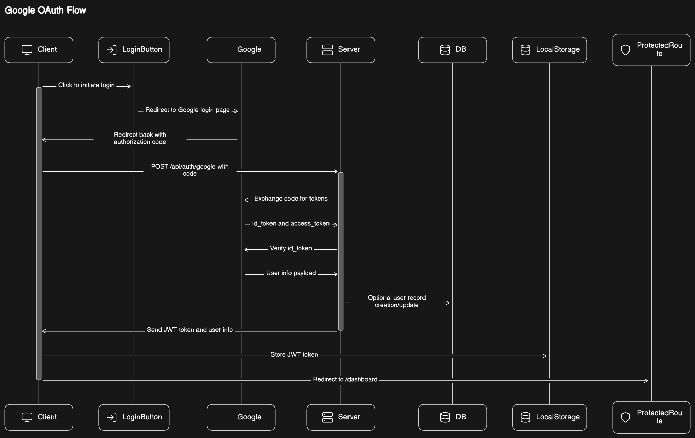

# LinkKeeper App

LinkKeeper es una aplicación web diseñada para permitir a los usuarios guardar y gestionar una colección personal de enlaces. Construida con React para el frontend y Node.js para el backend, esta aplicación ofrece una solución sencilla y eficiente para almacenar enlaces importantes, accesibles desde cualquier lugar. Con la opción de autenticación tradicional o mediante una cuenta de Google, LinkKeeper proporciona una experiencia de usuario segura y personalizada.


## Características

- **Modo Claro/Oscuro**: Cambia de modo claro u oscuro segun el sistema o preferencia del usuario
- **Autenticación de Usuario**: Inicie sesión con credenciales propias o a través de ****Google**** para una experiencia de usuario segura y personalizada
- **Dashboard Protegido**: Una vez autenticado, acceda a un área privada donde puede gestionar sus enlaces.
- **Gestión de Enlaces**: Guarde, visualice y organice sus enlaces de manera eficiente en su dashboard personal.

## Tecnologías Utilizadas

- **Frontend:** React, Radix-ui, shadcn/ui, TailwindCSS, 
- **Backend:** Node, Express
- **Autenticación:** JWT (Json Web Tokens) para la gestión de sesiones y autenticación de Google.
- **Base de Datos:** SQLITE. Los enlaces se almacenan en un archivo data.sqlite3 en el servidor.

## Estructura
El proyecto se divide en dos partes principales: el cliente (frontend) y el servidor (backend).

- ### Cliente (Frontend)
    Construido con React, el lado del cliente gestiona la interfaz de usuario y la interacción con el usuario. La autenticación y el manejo de los enlaces se realizan a través de peticiones al servidor.

- ### Servidor (Backend)
    El servidor, creado con Node.js, maneja la lógica de aplicación, autenticación y operaciones con los enlaces. La estructura es la siguiente:

    - ****Routes**: Contiene las rutas para la gestión de usuarios, dashboard y autenticación.**
        - ***authRoutes.js***: *Gestiona la autenticación y entrega de tokens.*
        - ***userDataRoutes.js***: *Permite operaciones relacionadas con los datos del usuario.*
        - ***dashboardRoutes.js***: *Accesible tras la autenticación, para la gestión de enlaces.*

    - ****Controllers**: Contiene la lógica para cada ruta.**
        - ***authController.js***: *Lógica de autenticación y entrega de tokens.*
        - ***userDataController.js***: *Gestión de datos de usuario.*
        - ***dashboardController.js***: *Operaciones del dashboard, como la gestión de enlaces.*

    - ****Middleware**:**
        - ***authMiddleware.js***: *Verifica la identidad del usuario mediante un token, asegurando que solo los usuarios autenticados accedan a ciertas rutas.*

    - ****Utils**:**
        - ***db.js***: *Maneja todas las funciones especificas que manipulan directamente la base de datos, la base de datos usada es SQLite.*
## Instalación

Para utilizar LinkKeeper, siga estos pasos:

1. **Clone el repositorio a su máquina local.**

    Ejecute el siguiente comando en su terminal:

    ```bash
    git clone https://github.com/davidcastagnetoa/uatcontrol.git
    ```

2. **Instale las dependencias necesarias** ejecutando `npm install` tanto en el directorio del cliente como del servidor.

    - **Cliente:**

        Navegue al directorio del cliente y cree el archivo `.env`, luego instale las dependencias:

        ```bash
        cd uat_login
        touch .env
        npm install
        ```

    - **Servidor:**

        Navegue al directorio del servidor, cree el archivo `.env`, y luego instale las dependencias:

        ```bash
        cd uat_login_backend
        touch .env
        npm install
        ```

3. **Configure las variables de entorno** necesarias para la base de datos y la autenticación de Google.

    Abra y edite los archivos `.env` en los directorios del cliente y del servidor para configurar las variables de entorno:

    - **Cliente:**

        ```bash
        code uat_login/.env
        ```

    - **Servidor:**

        ```bash
        code uat_login_backend/.env
        ```
## Variables de Entorno Requeridas
En los archivos uat_login/.env y uat_login_backend/.env, guarde el siguiente contenido

#### Para el Backend

```plaintext
# Archivo del servidor uat_login_backend/.env
# Eleccion propia
USER_NAME=
USER_PASSWORD=
JWT_SECRET=

# Las credenciales de tu proyecto creado en Google Developer Console
GOOGLE_CLIENT_ID=
GOOGLE_CLIENT_SECRET=
```

#### Para el Frontend

```plaintext
# Archivo del cliente uat_login/.env
REACT_APP_GOOGLE_CLIENT_ID=
REACT_APP_GOOGLE_SECRET=
```

## Configuración de Autenticación de Google

Para permitir la autenticación mediante Google en LinkKeeper, es necesario crear un proyecto en Google Developer Console y obtener las credenciales `GOOGLE_CLIENT_ID` y `GOOGLE_CLIENT_SECRET`. Sigue estos pasos para configurarlo:

1. **Visita Google Developer Console**: Dirígete a [Google Developer Console](https://console.developers.google.com/) y inicia sesión con tu cuenta de Google.

2. **Crea un nuevo proyecto**: Haz clic en el selector de proyecto en la parte superior de la página y luego en "Nuevo Proyecto". Proporciona un nombre para tu proyecto y haz clic en "Crear".

3. **Configura el consentimiento del usuario**: En el menú lateral, navega a "Pantallas de consentimiento" y elige el tipo de usuario externo, luego completa la información requerida para tu pantalla de consentimiento.

4. **Crea credenciales**:
    - En el menú lateral, ve a "Credenciales" y haz clic en "Crear credenciales".
    - Selecciona "ID de cliente de OAuth".
    - Configura el tipo de aplicación que estás creando (por ejemplo, aplicación web) y agrega los URI de redireccionamiento autorizados (En este ejemplo, `http://localhost`, `http://localhost:3000` y `http://localhost:8080` para desarrollo local).
    - En Origenes de Javascript lo mismo
    - Haz clic en "Crear".

5. **Obtén `GOOGLE_CLIENT_ID` y `GOOGLE_CLIENT_SECRET`**:
    - Una vez creadas las credenciales, se mostrará un diálogo con tu `GOOGLE_CLIENT_ID` y `GOOGLE_CLIENT_SECRET`.
    - Guarda estos valores; los necesitarás para configurar las variables de entorno en tu proyecto.

6. **Configura las variables de entorno**:
    - Añade `GOOGLE_CLIENT_ID` y `GOOGLE_CLIENT_SECRET` a tu archivo `.env` en el directorio del servidor como se indicó anteriormente.
    - Para el frontend, utiliza `REACT_APP_GOOGLE_CLIENT_ID` con el valor de tu `GOOGLE_CLIENT_ID` y `REACT_APP_GOOGLE_SECRET` con el valor de tu `GOOGLE_CLIENT_SECRET`.


## Desarrollo y Ejecución

Para ejecutar en local se debe abrir dos terminales, uno para cliente y otro para el servidor:

#### Cliente:

```bash
cd uat_login
npm start
```

#### Servidor:

```bash
cd uat_login_backend
node src/server.js
```

Abra su navegador y acceda a http://localhost:3000
## Authors

- [@davidcastagnetoa](https://www.github.com/davidcastagnetoa)


## Diagramas de Flujo



